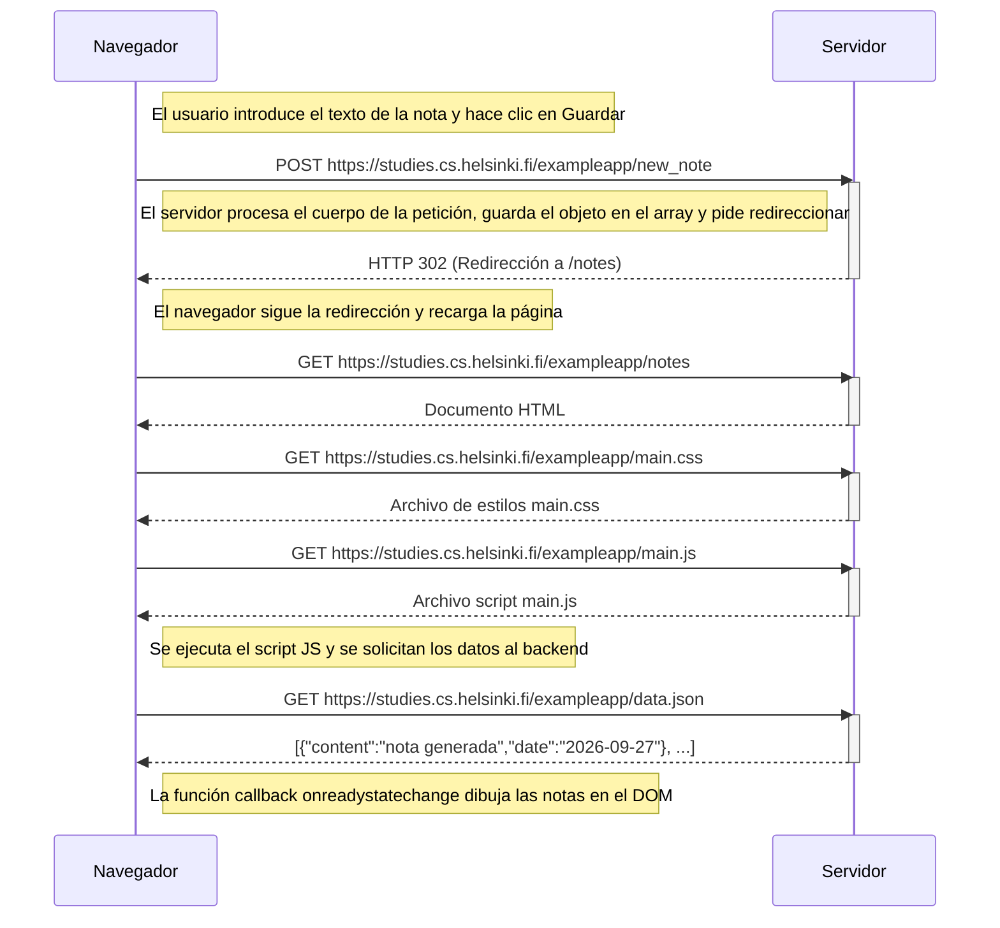

```mermaid
sequenceDiagram
    participant Navegador
    participant Servidor

    Note right of Navegador: El usuario introduce el texto de la nota y hace clic en Guardar
    Navegador->>Servidor: POST https://studies.cs.helsinki.fi/exampleapp/new_note
    activate Servidor
    Note left of Servidor: El servidor procesa el cuerpo de la petición, guarda el objeto en el array y pide redireccionar
    Servidor-->>Navegador: HTTP 302 (Redirección a /notes)
    deactivate Servidor
    
    Note right of Navegador: El navegador sigue la redirección y recarga la página
    Navegador->>Servidor: GET https://studies.cs.helsinki.fi/exampleapp/notes
    activate Servidor
    Servidor-->>Navegador: Documento HTML
    deactivate Servidor

    Navegador->>Servidor: GET https://studies.cs.helsinki.fi/exampleapp/main.css
    activate Servidor
    Servidor-->>Navegador: Archivo de estilos main.css
    deactivate Servidor

    Navegador->>Servidor: GET https://studies.cs.helsinki.fi/exampleapp/main.js
    activate Servidor
    Servidor-->>Navegador: Archivo script main.js
    deactivate Servidor

    Note right of Navegador: Se ejecuta el script JS y se solicitan los datos al backend
    Navegador->>Servidor: GET https://studies.cs.helsinki.fi/exampleapp/data.json
    activate Servidor
    Servidor-->>Navegador: [{"content":"nota generada","date":"2026-09-27"}, ...]
    deactivate Servidor

    Note right of Navegador: La función callback onreadystatechange dibuja las notas en el DOM
```