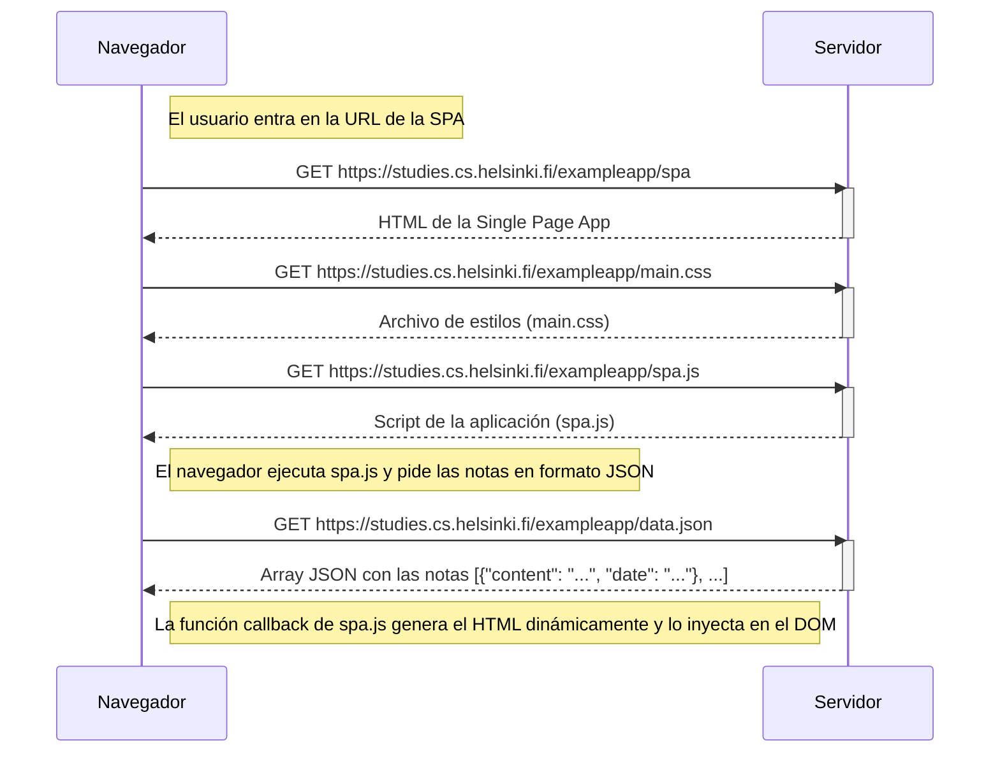

```mermaid
sequenceDiagram
    participant Navegador
    participant Servidor

    Note right of Navegador: El usuario entra en la URL de la SPA
    Navegador->>Servidor: GET https://studies.cs.helsinki.fi/exampleapp/spa
    activate Servidor
    Servidor-->>Navegador: HTML de la Single Page App
    deactivate Servidor

    Navegador->>Servidor: GET https://studies.cs.helsinki.fi/exampleapp/main.css
    activate Servidor
    Servidor-->>Navegador: Archivo de estilos (main.css)
    deactivate Servidor

    Navegador->>Servidor: GET https://studies.cs.helsinki.fi/exampleapp/spa.js
    activate Servidor
    Servidor-->>Navegador: Script de la aplicación (spa.js)
    deactivate Servidor

    Note right of Navegador: El navegador ejecuta spa.js y pide las notas en formato JSON
    Navegador->>Servidor: GET https://studies.cs.helsinki.fi/exampleapp/data.json
    activate Servidor
    Servidor-->>Navegador: Array JSON con las notas [{"content": "...", "date": "..."}, ...]
    deactivate Servidor

    Note right of Navegador: La función callback de spa.js genera el HTML dinámicamente y lo inyecta en el DOM
```