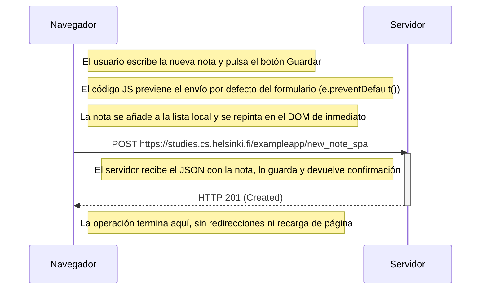

```mermaid
sequenceDiagram
    participant Navegador
    participant Servidor

    Note right of Navegador: El usuario escribe la nueva nota y pulsa el botón Guardar
    Note right of Navegador: El código JS previene el envío por defecto del formulario (e.preventDefault())
    Note right of Navegador: La nota se añade a la lista local y se repinta en el DOM de inmediato

    Navegador->>Servidor: POST https://studies.cs.helsinki.fi/exampleapp/new_note_spa
    activate Servidor
    Note left of Servidor: El servidor recibe el JSON con la nota, lo guarda y devuelve confirmación
    Servidor-->>Navegador: HTTP 201 (Created)
    deactivate Servidor

    Note right of Navegador: La operación termina aquí, sin redirecciones ni recarga de página
```